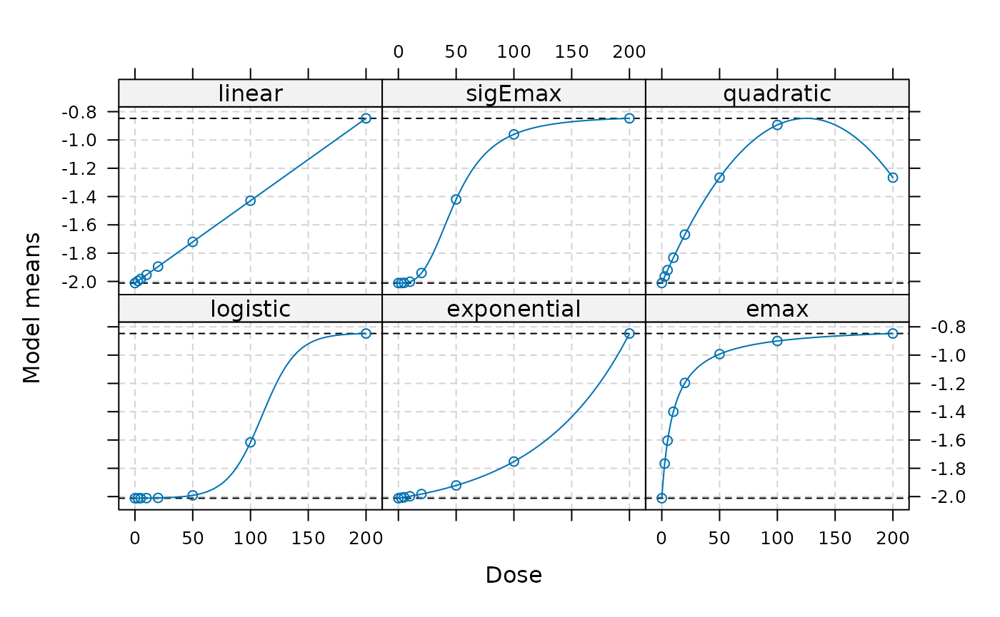

# Binary Endpoints in Bayesian MCP-Mod

**Show code**

``` r
suppressPackageStartupMessages({
  library(BayesianMCPMod)
  library(RBesT)
  library(DoseFinding)
  library(dplyr)
})

set.seed(7015)

display_params_table <- function(named_list) {
  round_numeric <- function(x, digits = 3) if (is.numeric(x)) round(x, digits) else x
  tbl <- data.frame(
    Name  = names(named_list),
    Value = I(lapply(named_list, function(v) {
      if (inherits(v, "Date")) v <- as.character(v)
      if (!is.null(names(v))) paste0("{", paste(names(v), v, sep="=", collapse=", "), "}")
      else v
    }))
  )
  tbl$Value <- lapply(tbl$Value, round_numeric)
  knitr::kable(tbl)
}
```

## Introduction

This vignette demonstrates the application of the `BayesianMCPMod`
package for a binary endpoint. A more detailed introduction is provided
for the setting of a continuous endpoint ([analysis example
vignette](https://boehringer-ingelheim.github.io/BayesianMCPMod/articles/analysis_normal.md)).

Binary endpoints require modeling on the logit scale. We will use the
migraine dataset from the `DoseFinding` package as our working example,
which contains response rates after migraine treatment. The prior (for
the control group) will be based on historical trial data.

This package makes use of the
[future](https://cran.r-project.org/package=future) framework for
parallel processing, which can be set up as follows:

``` r
future::plan(future::multisession)
```

### Scale conventions used in this vignette

**Scale conventions**

- Internally, **BayesianMCPMod** fits binary endpoints on the **logit
  scale**.
- `probability_scale = TRUE` controls whether outputs (summaries,
  predictions, plots) are transformed back to **probabilities**.
- `delta` for MED is interpreted on the **probability scale** when
  `probability_scale = TRUE`.

## Calculation of a MAP Prior

In a first step, a meta analytic prior will be calculated. This prior is
based on trials results for (Diener et al. 2011), (Ho et al. 2008) and
(Hewitt et al. 2011). Here we assume the following historical results
for the control group. Please note that only information from the
control group will be integrated leading to an informative mixture prior
for the control group, while for the active groups a non-informative
prior will be specified.

**Show code**

``` r
study <- c("study 1", "study 2", "study 3")
n <- c(70,  115, 147) #sample size per study
r <- c(6,   16, 16) # responder per study
```

Our approach to establish a MAP prior is conducted in 3 steps. First the
information from the historical trials is used to establish a beta
mixture MAP prior (family=binomial).  
In a next step this prior is robustified. Finally, since the
BayesianMCPMod procedure for binary endpoints requires a prior on the
logit scale, we translate this prior to this scale via sampling from the
distribution, transitioning the individual results to the logit scale
and approximating via fitting of normal mixtures of conjugate
distributions. Please note that there would be various other options to
establish a reasonable informative prior in this setting.

**Show code**

``` r
dose_levels <- c(0, 2.5, 5, 10, 20, 50, 100, 200)


#i) Establish MAP prior (beta mixture distribution)
set.seed(7015) # re-set seed only for this example; remove in your analysis script
map <- gMAP(
  cbind(r, n - r) ~ 1 |
    study,
  family = binomial,
  tau.dist = "HalfNormal",
  tau.prior = 0.5,
  beta.prior = (1 / sqrt(0.1 * 0.9)),
  warmup = 1000,
  iter = 10000,
  chains = 2,
  thin = 1
)
#> Assuming default prior location   for beta: 0
map
#> Generalized Meta Analytic Predictive Prior Analysis
#> 
#> Call:  gMAP(formula = cbind(r, n - r) ~ 1 | study, family = binomial, 
#>     tau.dist = "HalfNormal", tau.prior = 0.5, beta.prior = (1/sqrt(0.1 * 
#>         0.9)), iter = 10000, warmup = 1000, thin = 1, chains = 2)
#> 
#> Exchangeability tau strata: 1 
#> Prediction tau stratum    : 1 
#> Maximal Rhat              : 1 
#> 
#> Between-trial heterogeneity of tau prediction stratum
#>   mean     sd   2.5%    50%  97.5% 
#> 0.2710 0.2210 0.0106 0.2160 0.8290 
#> 
#> MAP Prior MCMC sample
#>   mean     sd   2.5%    50%  97.5% 
#> 0.1190 0.0494 0.0454 0.1130 0.2340
prior <- automixfit(map) #fits mixture distribution from MCMC samples from above
#ess(prior)
p <- summary(prior)[1]
#ii) Robustify prior
prior.rob <- RBesT::robustify(priormix = prior,
                              mean     = 0.5,
                              weight   = 0.4)

#ess(prior.rob)

#iii) Translate prior to logit scale (to approximate via normal mixture model)
r <- rmix(prior.rob, n = 1e4)
log.r <- RBesT::logit(r)
prior.ctr <- automixfit(log.r, type = "norm")
sigma(prior.ctr) <- sqrt(1 / (p * (1 - p)))
#ess(prior.ctr, sigma = sqrt(1/(p*(1-p))))
#Specification of reference scale (this follows the idea of [@Neuenschwander2016]).


#Specify a prior list
prior_trt <- RBesT::mixnorm(
  comp1 = c(
    w = 1,
    m = logit(summary(prior)[1]),
    n = 1
  ),
  sigma = sqrt(1 / (p * (1 - p))),
  param = "mn"
)

prior_list <- c(list(prior.ctr), rep(x     = list(prior_trt), times = length(dose_levels[-1])))

dose_names <- c("Ctr", paste0("DG_", seq_along(dose_levels[-1])))
names(prior_list) <- dose_names
```

## Dose-Response Model Shapes

Candidate models are specified on the parameter scale using the
{DoseFinding} package. We will create a `Mods` object, which will be
used in the remainder of the vignette. Please note that the models are
specified on the **logit scale**.

**Show code**

``` r
models <- Mods(
  linear = NULL,
  sigEmax = c(50, 3),
  quadratic = -1 / 250,
  logistic = c(110, 15),
  exponential = 80,
  emax = 10,
  doses = dose_levels,
  placEff = RBesT::logit(0.118),
  maxEff = RBesT::logit(0.3) - RBesT::logit(0.118)
)
```

``` r
plot(models)
```



### Trial Data

We will use the trial data from the migraine data set available in the
[DoseFinding](https://github.com/openpharma/DoseFinding) package as our
phase 2 trial data. We will apply a logistic regression (without any
additional covariates) to get estimates on the logit scale.

**Show code**

``` r

data("migraine") #example data "migraine" from DoseFinding package

dosesFact <- as.factor(dose_levels)
N <- migraine$ntrt
RespRate <- migraine$painfree/N

##Execution of logistic regression and readout of parameters 
## (please note that estimates are automatically on logit scale)
logfit <- glm(RespRate ~ dosesFact - 1, family = binomial, weights = N)
muHat <- coef(logfit)
S <- vcov(logfit)
```

## Posterior Calculation

In the first step of Bayesian MCPMod, the posterior is calculated by
combining the prior information with the estimated results of the trial
(Fleischer F 2022).

The summary of the posterior can be provided on the probability scale.

**Show code**

``` r
PostLogit<-getPosterior(prior_list,mu_hat=muHat,S_hat=S)
```

``` r
summary(PostLogit,probability_scale=TRUE)
#>           mean         sd       2.5%     50.0%     97.5%
#> Ctr  0.1071168 0.02127962 0.06930686 0.1058282 0.1520040
#> DG_1 0.1359001 0.06177459 0.04833967 0.1248126 0.2859179
#> DG_2 0.1222136 0.05057452 0.04865093 0.1137505 0.2436500
#> DG_3 0.2562256 0.05432101 0.16104931 0.2524449 0.3726678
#> DG_4 0.1943149 0.04961478 0.11121906 0.1895612 0.3041997
#> DG_5 0.2184915 0.05083942 0.13146633 0.2142515 0.3293963
#> DG_6 0.2401204 0.05496681 0.14521827 0.2358212 0.3591977
#> DG_7 0.3618200 0.06188555 0.24769337 0.3594987 0.4889697
```

## Bayesian MCPMod Test Step

The testing step of Bayesian MCPMod is executed using a critical value
on the probability scale and a pseudo-optimal contrast matrix.

A contrast matrix is generated based on the number of patients per dose
group (see (Fleischer F 2022) for more details). Please note that here
also other options would be possible (e.g. using weight based on the
observed variability).

The critical value is calculated using (re-estimated) contrasts for
frequentist MCPMod to ensure error control when using weakly-informative
priors.

**Show code**

``` r

contr_mat_prior <- getContr(
  mods           = models,
  dose_levels    = dose_levels,
  dose_weights   = N)

set.seed(7015) # re-sets seed only for this example; remove in your analysis script
crit_pval <- getCritProb(
  mods           = models,
  dose_levels    = dose_levels,
  cov_new_trial   = S,
  alpha_crit_val = 0.05
)
```

The Bayesian MCP testing step is then executed:

**Show code**

``` r

BMCP_result <- performBayesianMCP(
  posterior_list = PostLogit,
  contr          = contr_mat_prior, 
  crit_prob_adj  = crit_pval)
```

Here as well it should be noted that this evaluation happens on the
logit scale.

Summary information:

``` r
BMCP_result
#> Bayesian Multiple Comparison Procedure
#>   Significant:                   1 
#>   Critical Probability:          0.9790239 
#>   Maximum Posterior Probability: 0.99999 
#> Posterior Probabilities for Model Shapes
#>                        lin      sigE      quad       log       exp      emax
#>   Posterior Prob 0.9999900 0.9999338 0.9998325 0.9999509 0.9999644 0.9999885 
#>   Significant            1         1         1         1         1         1
```

The testing step is significant, indicating a non-flat dose-response
shape. All models are significant.

## Model Fitting and Visualization

In the model fitting step the posterior distribution is used as basis.

Both simplified and full fitting can be performed. Here we are focusing
on the simplified fit. Furthermore we specify that the fit should be
provided on the probability scale for easier interpretation of results.

The output of the fit includes information about the predicted effects
for the included dose levels, the generalized AIC, and the corresponding
weights.

**Show code**

``` r
##Perform modelling
model_fits <- getModelFits(
  models      = models,
  dose_levels = dose_levels,
  posterior   = PostLogit,
  simple      = TRUE,
  probability_scale = TRUE)
```

Plots of fitted dose-response models and an AIC-based average model
including credible bands (orange shaded areas, default levels are 50%
and 95%).:

``` r
#Default is on probability scale
plot(model_fits,cr_bands = TRUE)
```


In case models should be shown on the logit scale this can be done in
the following way:

``` r
plot(model_fits,probability_scale=FALSE)
```


Estimates (also for dose levels not included in the trial) can be shown
via:

``` r
display_params_table(stats::predict(model_fits, doses = c(0, 2.5, 10,150, 200)))
```

|             | Name        | Value                             |
|:------------|:------------|:----------------------------------|
| avgFit      | avgFit      | 0.120, 0.140, 0.170, 0.300, 0.327 |
| emax        | emax        | 0.106, 0.133, 0.184, 0.288, 0.292 |
| exponential | exponential | 0.150, 0.151, 0.156, 0.294, 0.375 |
| linear      | linear      | 0.146, 0.148, 0.154, 0.303, 0.372 |
| logistic    | logistic    | 0.137, 0.141, 0.151, 0.323, 0.345 |
| quadratic   | quadratic   | 0.138, 0.141, 0.151, 0.325, 0.351 |
| sigEmax     | sigEmax     | 0.107, 0.143, 0.176, 0.305, 0.322 |

The bootstrap-based quantiles can also be directly calculated via the
[`getBootstrapQuantiles()`](https://boehringer-ingelheim.github.io/BayesianMCPMod/reference/getBootstrapQuantiles.md)
function and a sample from the model fits can be bootstrapped using
[`getBootstrapSamples()`](https://boehringer-ingelheim.github.io/BayesianMCPMod/reference/getBootstrapSamples.md).

For this example, only 10 samples are bootstrapped for each model fit.

**Show code**

``` r
##Bootstrap quantiles
set.seed(7015) # re-sets seed only for this example; remove in your analysis script
bootstrap_quantiles <- getBootstrapQuantiles(
  model_fits = model_fits,
  quantiles  = c(0.025, 0.5, 0.975),
  doses      = dose_levels,
  n_samples  = 10)
```

## Assessment of the Minimally Efficacious Dose

The Minimally Efficacious Dose (MED) per model shape can be assessed
with the function
[`getMED()`](https://boehringer-ingelheim.github.io/BayesianMCPMod/reference/getMED.md).
The effect needs to be specified on the probability scale.

``` r
##get MED

getMED(
  delta       = 0.16,
  model_fits  = model_fits,
  dose_levels = seq(min(dose_levels), max(dose_levels), by = 1))
#>             avgFit emax exponential linear logistic quadratic sigEmax
#> med_reached      1    1           1      1        1         1       1
#> med            118   59         161    153      117       121      78
```

## Additional Note

Testing, modeling, and MED assessment can also be combined via
[`performBayesianMCPMod()`](https://boehringer-ingelheim.github.io/BayesianMCPMod/reference/performBayesianMCPMod.md):

**Show code**

``` r

BMCPMod_result <- performBayesianMCPMod(
  posterior_list = PostLogit,
  contr          = contr_mat_prior,
  crit_prob_adj  = crit_pval,
  simple         = TRUE,
  delta          = 0.16,
  probability_scale = TRUE
)
```

Diener, Hans-Christoph, Piero Barbanti, Carl Dahlöf, Uwe Reuter, Julia
Habeck, and Jana Podhorna. 2011. “BI 44370 TA, an Oral CGRP Antagonist
for the Treatment of Acute Migraine Attacks: Results from a Phase II
Study.” *Cephalalgia* 31 (5): 573–84.
<https://doi.org/10.1177/0333102410388435>.

Fleischer F, Deng Q, Bossert S. 2022. “Bayesian MCPMod.” *Pharmaceutical
Statistics* 21 (3): 654–70.

Hewitt, D. J., V. Martin, R. B. Lipton, J. Brandes, P. Ceesay, R.
Gottwald, E. Schaefer, C. Lines, and T. W. Ho. 2011. “Randomized
Controlled Study of Telcagepant Plus Ibuprofen or Acetaminophen in
Migraine.” *Headache* 51 (4): 533–43.
<https://doi.org/10.1111/j.1526-4610.2011.01860.x>.

Ho, Tony W., Lauren K. Mannix, Xiaoyin Fan, Clara Assaid, Carol Furtek,
Christopher J. Jones, Charles R. Lines, and Alan M. Rapoport. 2008.
“Randomized Controlled Trial of an Oral CGRP Receptor Antagonist,
MK-0974, in Acute Treatment of Migraine.” *Neurology* 70 (16): 1304–12.
<https://doi.org/10.1212/01.WNL.0000286940.29755.61>.
