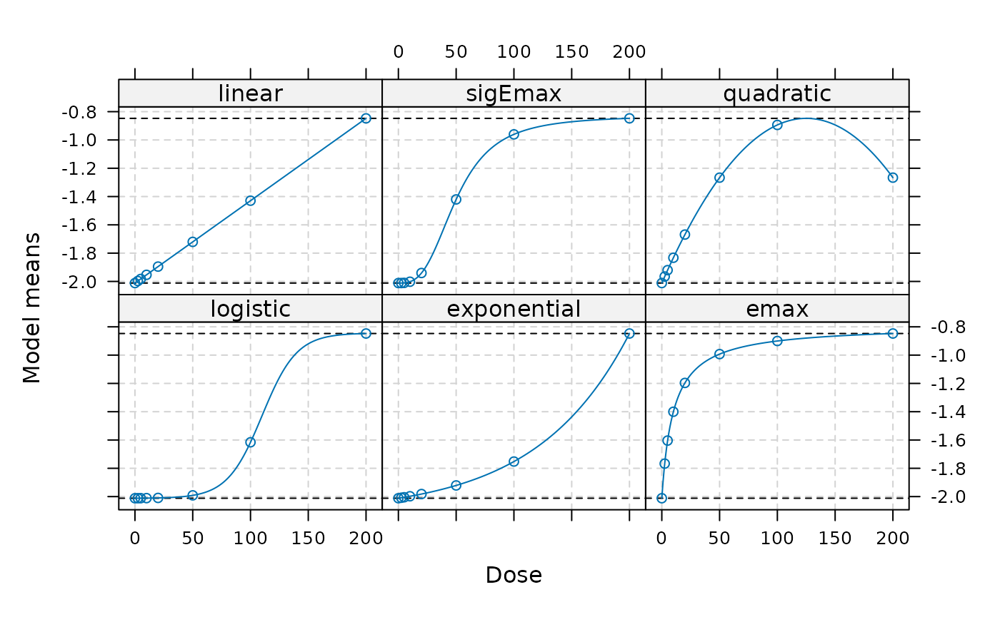
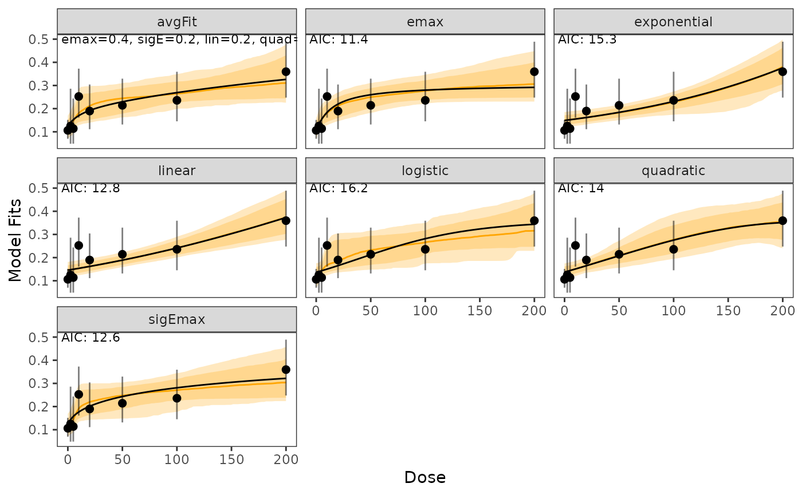
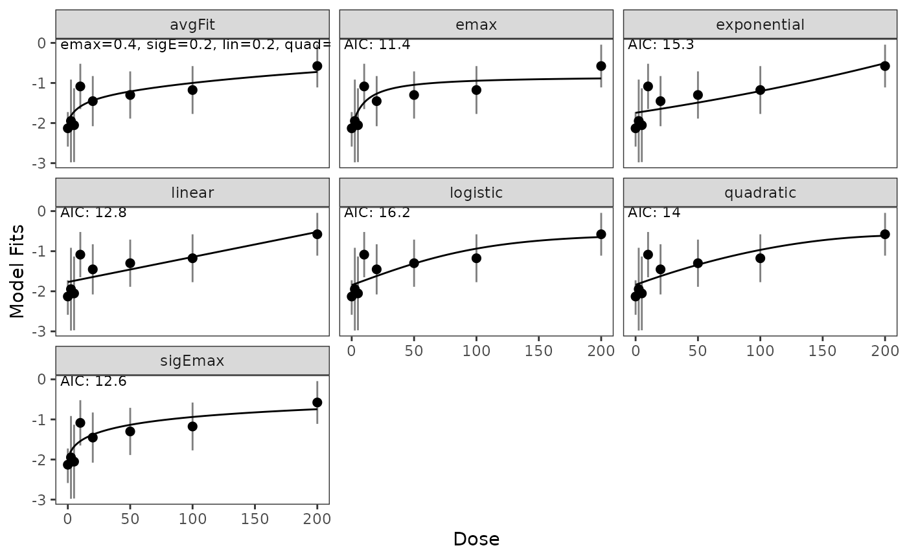

# Trial Analysis Example of Bayesian MCPMod for Binary Data

**Show code**

``` r

suppressPackageStartupMessages({
  library(BayesianMCPMod)
  library(RBesT)
  library(DoseFinding)
  library(dplyr)
})

set.seed(7015)

display_params_table <- function(named_list) {
  round_numeric <- function(x, digits = 3) if (is.numeric(x)) round(x, digits) else x
  tbl <- data.frame(
    Name  = names(named_list),
    Value = I(lapply(named_list, function(v) {
      if (inherits(v, "Date")) v <- as.character(v)
      if (!is.null(names(v))) paste0("{", paste(names(v), v, sep="=", collapse=", "), "}")
      else v
    }))
  )
  tbl$Value <- lapply(tbl$Value, round_numeric)
  knitr::kable(tbl)
}
```

## Introduction

This vignette demonstrates the application of the `BayesianMCPMod`
package for a binary endpoint. A more detailed introduction is provided
for the setting of a continuous endpoint ([analysis example
vignette](https://boehringer-ingelheim.github.io/BayesianMCPMod/articles/analysis_normal.md)).

Binary endpoints require modeling on the logit scale. We will use the
migraine dataset from the `DoseFinding` package as our working example,
which contains response rates after migraine treatment. The prior (for
the control group) will be based on historical trial data.

This package makes use of the
[future](https://cran.r-project.org/package=future) framework for
parallel processing, which can be set up for example as follows:

``` r

future::plan(future::multisession, workers = 4L)
```

Kindly note that due to overhead a reduced number of worker nodes can be
preferable and that for short calculations sequential execution can be
faster.

### Scale Conventions in `BayesianMCPMod`

- Internally, `BayesianMCPMod` fits binary endpoints on the **logit
  scale**.
- The function argument `probability_scale` controls whether outputs
  (summaries, predictions, plots) are back-transformed to
  **probabilities**.
- In
  [`simulateData()`](https://boehringer-ingelheim.github.io/BayesianMCPMod/reference/simulateData.md),
  outcomes are simulated on the response scale if
  `probability_scale = TRUE`.
- In
  [`getMED()`](https://boehringer-ingelheim.github.io/BayesianMCPMod/reference/getMED.md),
  `delta` is interpreted on the **probability scale** if
  `probability_scale = TRUE`.

## Calculation of a MAP Prior

For this example, in a first step, a meta analytic prior will be
calculated. This prior is based on trials results for Diener et al.
(2011), Ho et al. (2008) and Hewitt et al. (2011). Here, we assume the
following historical results for the control group. Please note that
only information from the control group will be integrated, leading to
an informative mixture prior for the control group, while a
non-informative prior will be specified for the active groups.

**Show code**

``` r

trial <- c("trial_1", "trial_2", "trial_3")
n     <- c(70,  115, 147) # sample size per trial
r     <- c( 6,   16,  16) # n responders per trial
```

Our approach to establish a MAP prior is conducted in 3 steps. First the
information from the historical trials is used to establish a beta
mixture MAP prior (family=binomial).  
In a next step this prior is robustified. Finally, since the
`BayesianMCPMod` procedures for binary endpoints require a prior on the
logit scale, we translate this prior to this scale via sampling from the
distribution, translating the results to the logit scale and
approximating via fitting of normal mixtures of conjugate distributions.
Please note that there would be other options to establish a reasonable
informative prior in this setting.

**Show code**

``` r

dose_levels <- c(0, 2.5, 5, 10, 20, 50, 100, 200)

# 1) Establish MAP prior (beta mixture distribution)
set.seed(7015) # re-set seed only for this example; remove in your analysis script
map <- gMAP(
  cbind(r, n - r) ~ 1 | trial,
  family     = binomial,
  tau.dist   = "HalfNormal",
  tau.prior  = 0.5,
  beta.prior = (1 / sqrt(0.1 * 0.9)),
  warmup     = 1000,
  iter       = 10000,
  chains     = 2,
  thin       = 1
)
#> Assuming default prior location   for beta: 0
map
#> Generalized Meta Analytic Predictive Prior Analysis
#> 
#> Call:  gMAP(formula = cbind(r, n - r) ~ 1 | trial, family = binomial, 
#>     tau.dist = "HalfNormal", tau.prior = 0.5, beta.prior = (1/sqrt(0.1 * 
#>         0.9)), iter = 10000, warmup = 1000, thin = 1, chains = 2)
#> 
#> Exchangeability tau strata: 1 
#> Prediction tau stratum    : 1 
#> Maximal Rhat              : 1 
#> 
#> Between-trial heterogeneity of tau prediction stratum
#>    mean      sd    2.5%     50%   97.5% 
#> 0.27100 0.22400 0.00958 0.21700 0.83700 
#> 
#> MAP Prior MCMC sample
#>   mean     sd   2.5%    50%  97.5% 
#> 0.1200 0.0501 0.0468 0.1130 0.2410

prior <- automixfit(map) #fits mixture distribution from MCMC samples from above
p     <- summary(prior)[1]

# 2) Robustify prior
prior_rob <- RBesT::robustify(priormix = prior,
                              mean     = 0.5,
                              weight   = 0.4)

# 3) Translate prior to logit scale (to approximate via normal mixture model)
r                <- rmix(prior_rob, n = 1e4)
log_r            <- RBesT::logit(r)
prior_ctr        <- automixfit(log_r, type = "norm")

# Specification of reference scale (this follows the idea of [@Neuenschwander2016]).
sigma(prior_ctr) <- sqrt(1 / (p * (1 - p)))

# Specify a prior list
prior_trt <- RBesT::mixnorm(
  comp1 = c(
    w = 1,
    m = logit(summary(prior)[1]),
    n = 1
  ),
  sigma = sqrt(1 / (p * (1 - p))),
  param = "mn"
)

prior_list <- c(list(prior_ctr),
                rep(x     = list(prior_trt),
                    times = length(dose_levels[-1])))

dose_names        <- c("Ctr", paste0("DG_", seq_along(dose_levels[-1])))
names(prior_list) <- dose_names
```

## Dose-Response Model Shapes

Candidate models are specified on the parameter scale using the
{DoseFinding} package. We will create a `Mods` object, which will be
used in the remainder of the vignette. Please note that the models are
specified on the **logit scale**.

``` r

models <- Mods(
  linear      = NULL,
  sigEmax     = c(50, 3),
  quadratic   = -1 / 250,
  logistic    = c(110, 15),
  exponential = 80,
  emax        = 10,
  doses       = dose_levels,
  placEff     = RBesT::logit(0.118),
  maxEff      = RBesT::logit(0.3) - RBesT::logit(0.118)
)

plot(models)
```



### Trial Data

We will use the trial data from the migraine data set available in the
`DoseFinding` package as our phase 2 trial data. We will apply a
logistic regression (without any additional covariates) to get estimates
on the logit scale.

``` r

data("migraine") # data set from the DoseFinding package

doses_fact <- as.factor(dose_levels)
n_patients <- migraine$ntrt
resp_rate  <- migraine$painfree/n_patients

## Execution of logistic regression and readout of parameters 
## Note that estimates are automatically on the logit scale.
log_fit <- glm(resp_rate ~ doses_fact - 1, family = binomial, weights = n_patients)
mu_hat  <- coef(log_fit)
S_hat   <- vcov(log_fit)
```

## Posterior Calculation

In the first step of Bayesian MCPMod, the posterior is calculated by
combining the prior information with the estimated results of the trial
(Fleischer F 2022).

``` r

post_logit <- getPosterior(prior_list, mu_hat = mu_hat, S_hat  = S_hat)
```

The summary of the posterior can be provided on the probability scale.

``` r

summary(post_logit, probability_scale = TRUE)
#>           mean         sd       2.5%     50.0%     97.5%
#> Ctr  0.1073879 0.02080215 0.07000671 0.1062163 0.1511844
#> DG_1 0.1359332 0.06177887 0.04836010 0.1248470 0.2859559
#> DG_2 0.1222403 0.05057858 0.04866771 0.1137779 0.2436832
#> DG_3 0.2562310 0.05431974 0.16105620 0.2524505 0.3726699
#> DG_4 0.1943253 0.04961450 0.11122884 0.1895720 0.3042085
#> DG_5 0.2184995 0.05083870 0.13147474 0.2142599 0.3294021
#> DG_6 0.2401274 0.05496562 0.14522644 0.2358285 0.3592014
#> DG_7 0.3618182 0.06188342 0.24769534 0.3594971 0.4889634
```

## Bayesian MCPMod Test Step

The testing step of Bayesian MCPMod is executed using a critical value
on the probability scale and a pseudo-optimal contrast matrix.

A contrast matrix is generated based on the number of patients per dose
group, see Fleischer F (2022) for more details. This choice is motivated
by the assessments reported in Liu et al. (2022), which demonstrate that
this type of contrast is robust and provides good statistical power
across a broad range of potential outcome scenarios. Please note that
also other options would be possible, e.g. using weight based on the
observed variability.

The critical value is calculated using (re-estimated) contrasts for
frequentist MCPMod to ensure error control when using weakly-informative
priors.

``` r

contr_mat_prior <- getContr(
  mods           = models,
  dose_levels    = dose_levels,
  dose_weights   = n_patients)

set.seed(7015) # re-sets seed only for this example; remove in your analysis script
crit_pval <- getCritProb(
  mods           = models,
  dose_levels    = dose_levels,
  cov_new_trial  = S_hat,
  alpha_crit_val = 0.05
)
```

The Bayesian MCP testing step is then executed:

``` r

BMCP_result <- performBayesianMCP(
  posterior_list = post_logit,
  contr          = contr_mat_prior, 
  crit_prob_adj  = crit_pval)
```

Here as well it should be noted that this evaluation happens on the
logit scale.

``` r

BMCP_result
#> Bayesian Multiple Comparison Procedure
#>   Significant:                   1 
#>   Critical Probability:          0.9790239 
#>   Maximum Posterior Probability: 0.9999902 
#> Posterior Probabilities for Model Shapes
#>                        lin      sigE      quad       log       exp      emax
#>   Posterior Prob 0.9999902 0.9999348 0.9998353 0.9999512 0.9999646 0.9999876 
#>   Significant            1         1         1         1         1         1
```

The testing step is significant, indicating a non-flat dose-response
shape. All model shapes are significant.

## Model Fitting and Visualization

In the model fitting step the posterior distribution is used as basis.

Both simplified and full fitting can be performed. Here we are focusing
on the simplified fit. Furthermore we specify that the fit should be
provided on the probability scale for easier interpretation of results.

The output of the fit includes information about the predicted effects
for the included dose levels, the generalized AIC, and the corresponding
weights.

``` r

model_fits <- getModelFits(
  models            = models,
  dose_levels       = dose_levels,
  posterior         = post_logit,
  simple            = TRUE,
  probability_scale = TRUE)
```

Plots of fitted dose-response models and an AIC-based average model
including 80% and 95% credible bands on the probability scale:

``` r

plot(model_fits, cr_bands = TRUE)
```



In case models should be shown on the logit scale this can be done in
the following way:

``` r

plot(model_fits, probability_scale = FALSE)
```



Estimates including predictions can be shown via:

``` r

display_params_table(stats::predict(model_fits, doses = c(0, 2.5, 10,150, 200)))
```

|             | Name        | Value                             |
|:------------|:------------|:----------------------------------|
| avgFit      | avgFit      | 0.120, 0.140, 0.170, 0.300, 0.326 |
| emax        | emax        | 0.106, 0.133, 0.184, 0.288, 0.292 |
| exponential | exponential | 0.149, 0.150, 0.155, 0.294, 0.376 |
| linear      | linear      | 0.146, 0.148, 0.154, 0.303, 0.373 |
| logistic    | logistic    | 0.136, 0.140, 0.150, 0.324, 0.344 |
| quadratic   | quadratic   | 0.137, 0.141, 0.151, 0.326, 0.351 |
| sigEmax     | sigEmax     | 0.107, 0.143, 0.176, 0.305, 0.322 |

The bootstrap-based quantiles can also be directly calculated via the
[`getBootstrapQuantiles()`](https://boehringer-ingelheim.github.io/BayesianMCPMod/reference/getBootstrapQuantiles.md)
function and a sample from the model fits can be bootstrapped using
[`getBootstrapSamples()`](https://boehringer-ingelheim.github.io/BayesianMCPMod/reference/getBootstrapSamples.md).

For this example, only 10 samples are bootstrapped for each model fit.

``` r

set.seed(7015) # re-sets seed only for this example; remove in your analysis script
bootstrap_quantiles <- getBootstrapQuantiles(
  model_fits = model_fits,
  quantiles  = c(0.025, 0.5, 0.975),
  doses      = dose_levels,
  n_samples  = 10)
```

## Assessment of the Minimally Efficacious Dose

The Minimally Efficacious Dose (MED) per model shape can be assessed
with the function
[`getMED()`](https://boehringer-ingelheim.github.io/BayesianMCPMod/reference/getMED.md).
The effect needs to be specified on the probability scale.

``` r

getMED(
  delta       = 0.16, # on probability scale
  model_fits  = model_fits,
  dose_levels = seq(min(dose_levels), max(dose_levels), by = 1))
#>             avgFit emax exponential linear logistic quadratic sigEmax
#> med_reached      1    1           1      1        1         1       1
#> med            117   60         161    152      115       120      79
```

### Additional Note

Testing, modeling, and MED assessment can also be combined via
[`performBayesianMCPMod()`](https://boehringer-ingelheim.github.io/BayesianMCPMod/reference/performBayesianMCPMod.md):

``` r

BMCPMod_result <- performBayesianMCPMod(
  posterior_list    = post_logit,
  contr             = contr_mat_prior,
  crit_prob_adj     = crit_pval,
  simple            = TRUE,
  delta             = 0.16,
  probability_scale = TRUE
)
```

Diener, Hans-Christoph, Piero Barbanti, Carl Dahlöf, Uwe Reuter, Julia
Habeck, and Jana Podhorna. 2011. “BI 44370 TA, an Oral CGRP Antagonist
for the Treatment of Acute Migraine Attacks: Results from a Phase II
Study.” *Cephalalgia* 31 (5): 573–84.
<https://doi.org/10.1177/0333102410388435>.

Fleischer F, Deng Q, Bossert S. 2022. “Bayesian MCPMod.” *Pharmaceutical
Statistics* 21 (3): 654–70.

Hewitt, D. J., V. Martin, R. B. Lipton, et al. 2011. “Randomized
Controlled Study of Telcagepant Plus Ibuprofen or Acetaminophen in
Migraine.” *Headache* 51 (4): 533–43.
<https://doi.org/10.1111/j.1526-4610.2011.01860.x>.

Ho, Tony W., Lauren K. Mannix, Xiaoyin Fan, et al. 2008. “Randomized
Controlled Trial of an Oral CGRP Receptor Antagonist, MK-0974, in Acute
Treatment of Migraine.” *Neurology* 70 (16): 1304–12.
<https://doi.org/10.1212/01.WNL.0000286940.29755.61>.

Liu, Yi, Sebastian Bossert, Rui Wu, Dooti Roy, Frank Fleischer, and Qiqi
Deng. 2022. *Commentary: Analyzing Binary Data Using MCPMod When Zero
Counts Are Expected*. <https://arxiv.org/abs/2202.08781>.
